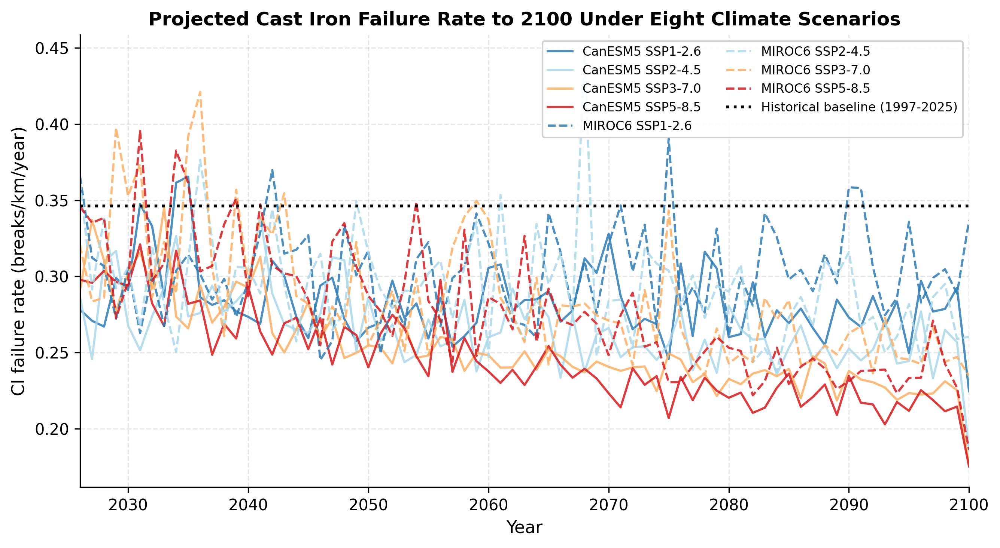
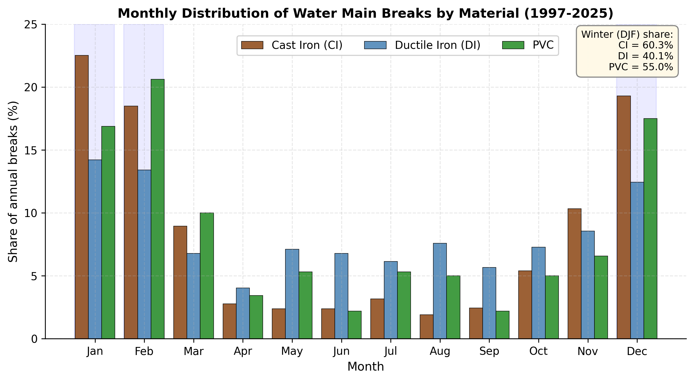
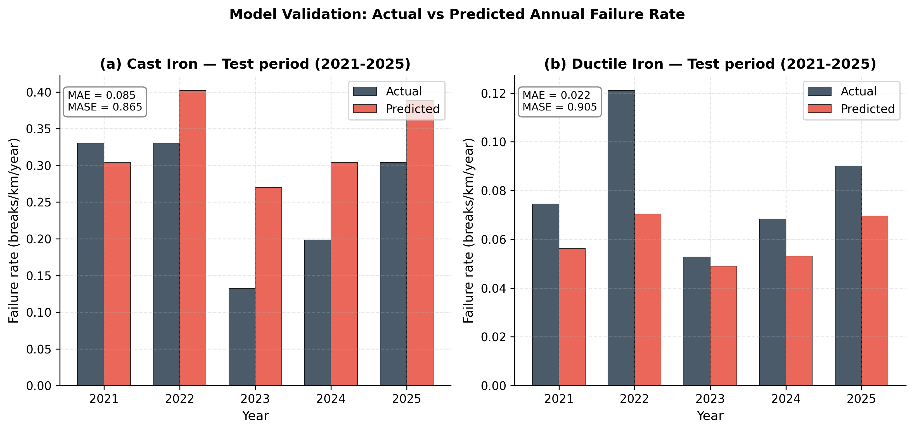
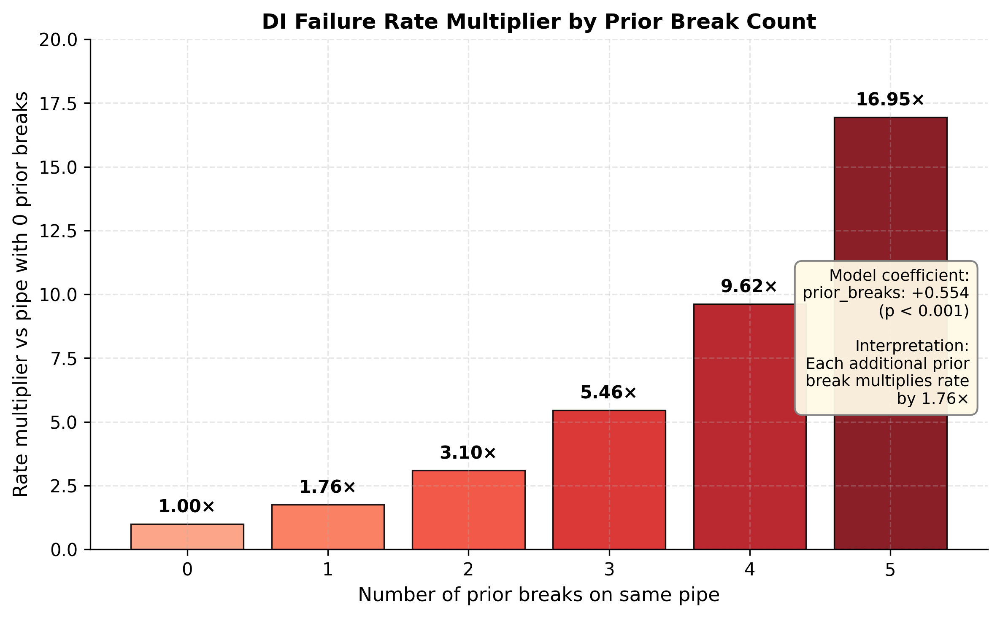

# Climate-Integrated Water Main Failure Prediction for Kitchener, Ontario

## Project Overview

This study develops a monthly count-regression framework to predict water main failures in Kitchener, Ontario, and projects failure rates to 2100 under eight CMIP6 climate scenarios. The analysis covers 16,207 pipe segments (938.3 km) and 2,869 recorded main breaks between 1997 and 2025.

The work extends the Kitchener case study of Khashei et al. (2024) by replacing decade-level binary classification with monthly negative binomial count regression, adopting strictly temporal validation instead of random train–test splits, and adding pipe-level deterioration and design-life analyses.

**Headline finding:** under all eight climate scenarios, cast iron failure rates are projected to *decline* by 11–37% by the 2080s. Cast-iron failures are strongly associated with frost-related conditions in Kitchener, so reduced freezing exposure under warmer winters is the principal climate mechanism represented by the model.

---

## Research Questions

1. How will projected climate change affect water main break frequency in Kitchener through 2100?
2. Which pipe materials are most climate-sensitive?
3. How does projected climate change affect the proportion of ductile iron pipes that experience a first break before their design life?

---

## Study Area

City of Kitchener, Ontario, Canada (43.45°N, 80.49°W) — a cold-climate municipality with a network dominated by pre-1970 cast iron and post-1980 ductile iron and PVC.

| Material | Pipes | Length (km) | Break rate (breaks/km/yr) | Winter (DJF) share of breaks |
|---|---|---|---|---|
| Cast iron (CI) | 2,013 | 151.3 | 0.346 | 60.3% |
| Ductile iron (DI) | 5,099 | 322.1 | 0.066 | 40.1% |
| PVC | 8,078 | 383.1 | 0.029 | 55.0% |
| **Network total** | **16,207** | **938.3** | — | — |

Breaks by material, 1997–2025: CI = 1,519; DI = 619; PVC = 320. These three modeled materials account for 2,458 of the 2,869 recorded main breaks; the remaining 411 breaks occurred in other pipe materials and were excluded from the material-specific analysis.

---

## Data Sources

| Dataset | Source | Coverage |
|---|---|---|
| Water main inventory and break records | City of Kitchener Open Data Portal | 16,207 pipes; 2,869 main breaks, 1997–2025 |
| Daily temperature observations | Environment and Climate Change Canada (three Kitchener–Waterloo stations) | 1996–2025 |
| 1981–2010 climate normals | Environment and Climate Change Canada | Reference baseline |
| Downscaled climate projections | PCIC CanDCS-M6 (MBCn multivariate bias correction) | 2026–2100 |

Climate projections use two general circulation models (CanESM5, MIROC6) across four emissions pathways (SSP1-2.6, SSP2-4.5, SSP3-7.0, SSP5-8.5), giving eight scenario combinations.

**Note on raw data:** the `data/` directory is excluded from version control. Source files must be downloaded from the portals above before running the pipeline.

---

## Methodology

### Study period

The analysis is restricted to 1997–2025. Although the break record nominally begins in 1985, a data audit found only 10 break records across 1985–1996 compared with 99 in 1997 alone, indicating that systematic logging began in 1997. Including the near-empty early years would introduce a spurious upward trend that any climate coefficient fitted over that window would partly absorb.

### Cohort model — climate projection

Monthly negative binomial generalised linear model, fitted separately for CI and DI, with a `log(km in service)` exposure offset:

```
log(μ) = log(km) + β₀ + Σ βₖ · climate_k
```

The negative binomial specification is required by overdispersion in the count data (variance-to-mean ratio: CI = 5.6, DI = 1.8), which violates the Poisson equal-dispersion assumption.

**Covariates:** freezing index (FI), freezing days (FD), freeze–thaw cycles (FTC), cumulative freezing index since October, mean/min/max temperature, average daily temperature range, and temperature-gradient terms — each also at 1-, 2-, and 3-month lags to represent delayed climate–failure relationships. Feature selection used backward stepwise AIC, with model selection confined to pre-test observations for each temporal split. Final test-period observations were not used for coefficient estimation, feature selection, or model choice.

**Precipitation excluded:** the primary station for 2010–2025 records total precipitation inconsistently relative to the earlier stations, introducing a station-change artefact that would contaminate any precipitation coefficient. Temperature records are consistent across all stations for the full period.

**Collinear covariates removed before fitting:** thawing days (r = −1.00 with FD) and thawing index (r = 0.98 with mean temperature).

### Pipe-level model — deterioration

Negative binomial model on a pipe-year panel (145,525 DI pipe-years, 576 linked break events), with `log(pipe length)` offset. Because individual pipes contribute repeated annual observations, inference uses standard errors clustered by pipe ID:

```
breaks ~ age + age² + prior_breaks
```

Because age varies *across pipes within* each calendar year, this specification separates the age effect from calendar time — which is not possible at cohort level (see Limitations).

### Design-life analysis

Analytical survival simulation, pipe by pipe, over a 2025–2050 planning horizon against a 75-year nominal ductile-iron service-life planning benchmark:

```
hazard(t)   = 1 − exp(−rate(t) × length_km)
S(t)        = Π (1 − hazard)
P(first failure in year t) = S(t−1) × hazard(t)
```

Annual rates combine the pipe-level deterioration model with the scenario-specific climate multiplier from the cohort projection.

---

## Quality Control and Validation

**Temporal validation.** Two strictly temporal splits were used; the model never sees test-period data during training. This tests genuine forecast skill rather than interpolation between observed years.

| Split | Training | Testing | Role |
|---|---|---|---|
| B | 1997–2020 | 2021–2025 | Primary |
| A | 1997–2016 | 2022–2025 (validation 2017–2021) | Robustness check |

**Benchmark.** All models are scored against a seasonal naive baseline (mean breaks per calendar month). MASE < 1 indicates the climate model outperforms seasonality alone.

**Checks performed and passed:**

- Break counts and network totals reconciled against the raw source files
- All coefficient signs consistent with the frost-loading mechanism
- All eight projections decline; within each GCM, higher emissions produce larger declines (monotonic dose–response)
- Empirical coverage of the nominal 90% prediction intervals was 95–100% across materials and temporal splits, indicating conservative uncertainty intervals
- Survivorship bias verified empirically: DI break incidence rises from 1.1% (age 20–30) to 22.4% (age 60–70), then falls to zero for the six pipes older than 70 years, with 82.6% of pipes aged 60+ never having broken
- CI selects an identical feature set under both temporal splits, confirming stability

---

## Key Results

### 1. Model performance

| Material | Split | Training | Testing | MAE (breaks/km/yr) | MASE | 90% coverage | Bias |
|---|---|---|---|---|---|---|---|
| CI | B (primary) | 1997–2020 | 2021–2025 | **0.085** | 0.865 | 100% | +0.94 |
| CI | A (robustness) | 1997–2016 | 2022–2025 | 0.100 | 0.789 | 100% | +1.27 |
| DI | B (primary) | 1997–2020 | 2021–2025 | **0.022** | 0.905 | 95.0% | −0.58 |
| DI | A (robustness) | 1997–2016 | 2022–2025 | 0.023 | 0.889 | 97.9% | −0.63 |

All four models outperform the seasonal naive baseline (MASE < 1), indicating modest but consistent predictive value from the climate-informed specification under strictly temporal evaluation. The resulting error magnitudes also fall within the 0.040–0.192 breaks/km/yr range reported for Saskatoon by Khashei et al. (2024).

### 2. Climate drivers

Cast iron, Split B (all coefficients significant):

**Freezing-index sign convention:** FI is calculated as the sum of negative daily mean temperatures, so stronger freezing produces increasingly negative FI values. Consequently, a negative FI coefficient indicates that more severe freezing is associated with a higher expected break rate.

| Feature | Coefficient | p-value | Direction |
|---|---|---|---|
| Freezing index | −0.00420 | 0.0007 | More severe freezing → higher expected break rate |
| Mean temperature, lag 1 month | −0.05664 | 0.0019 | Colder prior month → more breaks |
| Freezing days, lag 1 month | −0.03472 | 0.0332 | More freezing days → more breaks |
| Seasonal (cos) term | +0.72855 | <0.0001 | Winter concentration |

Ductile iron, Split B: freezing index (p < 0.0001), freezing index at lag 2 (p = 0.038), freezing days at lag 2 (p = 0.011). The dominant DI response occurs at approximately a two-month lag compared with one month for CI. Delayed transmission of surface freezing conditions to pipe depth is one possible physical explanation, although burial-depth data were unavailable to test this mechanism directly.

### 3. Climate projections to 2100

Change in mean failure rate for 2071–2100 relative to the 1997–2025 baseline (CI = 0.346, DI = 0.066 breaks/km/yr):

| GCM | SSP1-2.6 | SSP2-4.5 | SSP3-7.0 | SSP5-8.5 |
|---|---|---|---|---|
| CanESM5 — CI | −20.7% | −27.3% | −33.4% | −36.6% |
| MIROC6 — CI | −10.9% | −19.3% | −25.4% | −30.3% |
| CanESM5 — DI | −21.0% | −23.1% | −22.8% | −22.5% |
| MIROC6 — DI | −12.3% | −17.2% | −20.0% | −21.2% |

Every scenario projects a decline. Within each GCM, higher-emission pathways produce larger reductions. At end of century, emissions-scenario choice contributes roughly twice the projection spread of GCM structural differences for cast iron.

### 4. Pipe-level deterioration (ductile iron)

Each prior break multiplies the subsequent failure rate by **1.76×** (p < 0.0001):

| Prior breaks | 0 | 1 | 2 | 3 | 4 | 5 |
|---|---|---|---|---|---|---|
| Rate multiplier | 1.00× | 1.76× | 3.10× | 5.46× | 9.62× | 16.95× |

Age also shows a significant nonlinear relationship with failure rate: relative risk increases through middle age and reaches a fitted maximum near **56 years** before declining. Because the oldest surviving pipes represent a selected group of robust assets, this downturn is interpreted cautiously as survivorship bias rather than evidence that deterioration reverses with age. Prior break history therefore remains the more robust and actionable deterioration signal.

### 5. Design life

| Scenario | DI pipes with first break before 75-yr design life, by 2050 |
|---|---|
| Historical baseline | 11.2% |
| Warming scenarios (range across all eight) | 9.4% – 10.3% |

Mean age at first break is approximately 57 years — about 18 years before the 75-year nominal service-life planning benchmark — and varies by less than 0.3 years across all scenarios.

---

## Figures

### Figure 1 — Projected cast iron failure rate to 2100



All eight scenarios fall below the 1997–2025 historical baseline (dotted line). Within each GCM, higher-emission pathways produce larger declines — a pattern consistent with stronger reductions in frost-related loading under greater warming.

### Figure 2 — Monthly distribution of breaks by material



Cast iron breaks concentrate sharply in December–February (60.3% of annual total) compared with ductile iron (40.1%), the empirical basis for cast iron's greater climate sensitivity.

### Figure 3 — Model validation on held-out test years



Actual versus predicted annual failure rates for the 2021–2025 test period, which the model never saw during training. Cast iron predictions run consistently above observed values, reflecting ongoing replacement of failure-prone segments.

### Figure 4 — Ductile iron failure rate by prior break count



Each prior break multiplies the subsequent failure rate by 1.76×, compounding to nearly 17× at five prior breaks. This effect is independent of climate and larger than the projected climate benefit.

---

## Interpretation

Cast-iron failures in Kitchener are strongly associated with frost-related conditions: 60.3% of CI breaks occur in December–February, and the selected climate predictors are dominated by freezing-related variables. This pattern is consistent with frost loading being an important contributor to CI failures in this cold-climate network. As winters warm, modeled freezing exposure declines and the projected failure rate falls accordingly, explaining why higher-emission scenarios generally produce larger reductions.

The direction of this result is supported independently in the literature. Fan et al. (2023), analysing 29,621 failure records from Cleveland, Ohio, concluded that pipes in cold regions may experience fewer breaks under warmer weather and milder winters, while pipes in hot regions face more corrosion-driven failures. Bruaset and Sægrov (2018), using 25,573 failures from nine Norwegian cities, established a statistically significant inverse relationship between temperature and failure rate and projected a 2.7–7.2% reduction in failures by 2070 depending on scenario. The Kitchener winter break share for cast iron (60.3%) closely matches the 60% reported for Norwegian grey cast iron in that study.

**This does not mean the network becomes safer.** Reduced frost loading acts on a network that continues to age and accumulate damage. The pipe-level analysis shows that a ductile iron pipe with a single prior break already faces 1.76× the failure rate of an equivalent pipe with none — an effect independent of climate, and larger in magnitude than the projected climate benefit. For asset management, break history is therefore the more actionable prioritisation signal, and the projected climate relief should not be read as grounds to defer renewal.

---

## Limitations

1. **Age and climate effects cannot be jointly decomposed for cast iron.** Kitchener's CI was installed almost entirely before 1970, forming a closed cohort in which pipe age and calendar year are collinear (r > 0.99). Adding a time-varying age proxy to the cohort model does not improve fit, and even at pipe level the CI age coefficient is not significant (p = 0.91) because survivorship bias leaves only robust survivors in the oldest cohort. This study therefore reports climate and deterioration effects separately rather than attempting a formal attribution.
2. **Precipitation excluded.** Station inconsistency after 2010 prevents reliable use of precipitation covariates, so drought-driven soil-settlement failures are outside the model's scope.
3. **No soil data.** Shrink–swell behaviour, soil corrosivity, and bedding conditions are not represented.
4. **Freeze–thaw bias in CanESM5.** The model projects 13–14 freeze–thaw cycles in January against 8.5 observed, a known weakness of threshold-crossing variables in GCM output.
5. **Ductile iron feature selection is less stable than cast iron.** Different features are selected under the two temporal splits (only the freezing index is common to both), reflecting the genuinely weaker DI climate signal. DI projections should be treated as indicative rather than definitive.
6. **PVC excluded from climate modelling.** Only nine test-period events — insufficient for reliable evaluation.
7. **Static network assumption.** Projections hold exposure at 2025 levels; future replacement and expansion are not modelled.
8. **Single city, 29 years.** Results are specific to Kitchener, and the record is short for climate attribution.
9. **Limited GCM ensemble.** The projections use two CMIP6 models, CanESM5 and MIROC6, selected to represent contrasting climate responses. The eight GCM–SSP combinations therefore capture pathway and inter-model differences but do not represent the full range of CMIP6 structural uncertainty.
10. **Design-life analysis assumes multiplicative independence** between climate and pipe-level deterioration effects, and freezes prior-break counts at 2025 values.

---

## Conclusions

1. Projected warming reduces modeled water main failure rates in Kitchener by 11–37% (CI) and 12–23% (DI) by the 2080s, consistently across all eight climate scenarios.
2. Cast iron is markedly more climate-sensitive than ductile iron, by winter break concentration, coefficient magnitude, and projected change.
3. Prior break history is the strongest available deterioration signal for ductile iron, with each break multiplying subsequent risk by 1.76×.
4. Under historical climate, 11.2% of ductile iron pipes are projected to experience a first break before the 75-year nominal service-life planning benchmark within the 2025–2050 horizon; warming reduces this modestly to 9.4–10.3%, but does not meaningfully change the age at which first breaks occur.
5. Network renewal targeting pipes with prior break histories remains the dominant risk-management lever; projected climate warming provides a modest offsetting benefit through reduced frost loading.

---

## Repository Structure

```
kitchener-climate-watermain/
├── README.md
├── requirements.txt
├── .gitignore
├── scripts/
│   ├── build_panel.py                 Break records + inventory → monthly panel
│   ├── build_climate.py               ECCC stations → monthly climate covariates
│   ├── build_final_dataset.py         Break panel + climate → modelling dataset
│   ├── model_negbinom_v2.py           Negative binomial models, both temporal splits
│   ├── process_cmip6.py               CMIP6 NetCDF → monthly projected covariates
│   ├── project_breaks.py              Failure-rate projections, 2026–2100
│   ├── di_pipe_level_analysis.py      DI age and prior-break model
│   ├── di_design_life_analysis.py     DI design-life survival simulation
│   ├── run_all_results.py             Runs models + pipe-level + design life
│   └── make_figures.py                Generates all four figures
├── figures/                           Output figures (300 dpi)
├── data/                              Source data (not tracked — see Data Sources)
└── results/                           Generated outputs (not tracked)
```

---

## How to Reproduce the Analysis

**1. Install dependencies**

```bash
pip install -r requirements.txt
```

**2. Obtain source data**

Download the files listed under Data Sources into `data/`. The repository does not redistribute City of Kitchener, ECCC, or PCIC data.

**3. Run the pipeline in order**

```bash
python scripts/build_panel.py            # → monthly_panel_primary.csv
python scripts/build_climate.py          # → climate_monthly.csv
python scripts/build_final_dataset.py    # → modelling_dataset.csv
python scripts/process_cmip6.py          # → cmip6_monthly_*.csv  (8 files)
python scripts/project_breaks.py         # → projections_annual.csv
python scripts/run_all_results.py        # → model, pipe-level, design-life results
python scripts/make_figures.py           # → all four figures
```

Each script expects its input files in the working directory and writes outputs to the same location. Scripts are self-documenting: each begins with a docstring stating its inputs, outputs, and the methodological choices it implements.

---

## Software and Tools

Python 3.9+ — `pandas`, `numpy`, `statsmodels` (negative binomial GLM), `scipy` (prediction intervals), `netCDF4` (CMIP6 ingestion), `matplotlib` (figures).

---

## References
Ahmad, T., Shaban, I. A., & Zayed, T. (2023). A review of climatic impacts on water main deterioration. Urban Climate, 49, 101552. https://doi.org/10.1016/j.uclim.2023.101552

Barton, N. A., Farewell, T. S., Hallett, S. H., & Acland, T. F. (2019). Improving pipe failure predictions: Factors affecting pipe failure in drinking water networks. Water Research, 164, 114926. https://doi.org/10.1016/j.watres.2019.114926

Bruaset, S., & Sægrov, S. (2018). An analysis of the potential impact of climate change on the structural reliability of drinking water pipes in cold climate regions. Water, 10(4), 411. https://doi.org/10.3390/w10040411

Cannon, A. J. (2018). Multivariate quantile mapping bias correction: An N-dimensional probability density function transform for climate model simulations of multiple variables. Climate Dynamics, 50(1–2), 31–49. https://doi.org/10.1007/s00382-017-3580-6

Eyring, V., Bony, S., Meehl, G. A., Senior, C. A., Stevens, B., Stouffer, R. J., & Taylor, K. E. (2016). Overview of the Coupled Model Intercomparison Project Phase 6 (CMIP6) experimental design and organization. Geoscientific Model Development, 9(5), 1937–1958. https://doi.org/10.5194/gmd-9-1937-2016

Fan, X., Zhang, X., Yu, A., Speitel, M., & Yu, X. (2023). Assessment of the impacts of climat change on water supply system pipe failures. Scientific Reports, 13, 7349. https://doi.org/10.1038/s41598-023-33548-7

Folkman, S. (2018). Water main break rates in the USA and Canada: A comprehensive study. Utah State University. Utah State University record

Kakoudakis, K. I., Farmani, R., & Butler, D. (2018). Pipeline failure prediction in water distribution networks using weather conditions as explanatory factors. Journal of Hydroinformatics, 20(5), 1191–1200. https://doi.org/10.2166/hydro.2018.152

Khashei, M., Boloukasli Ahmadgourabi, F., & Dziedzic, R. (2024). Predicting the future failures of urban water systems: Integrating climate change and machine learning prediction models. Engineering Proceedings, 69(1), 35. https://doi.org/10.3390/engproc2024069035

Khashei, M., Dziedzic, R., & Roshani, E. (2024). Framework for predicting water main breaks in the face of climate change. In World Environmental and Water Resources Congress 2024: Climate change impacts on the world we live in (pp. 1326–1338). American Society of Civil Engineers. https://doi.org/10.1061/9780784485477.119

Rajani, B., Kleiner, Y., & Sink, J.-E. (2012). Exploration of the relationship between water main breaks and temperature covariates. Urban Water Journal, 9(2), 67–84. https://doi.org/10.1080/1573062X.2011.630093

Zamenian, H., Mannering, F. L., Abraham, D. M., & Iseley, T. (2017). Modeling the frequency of water main breaks in water distribution systems: Random-parameters negative-binomial approach. Journal of Infrastructure Systems, 23(2), 04016035. https://doi.org/10.1061/(ASCE)IS.1943-555X.0000336

**Data:** City of Kitchener Open Data Portal; Environment and Climate Change Canada Historical Climate Data; Pacific Climate Impacts Consortium (2024), *Statistically Downscaled Climate Scenarios — CanDCS-M6*, University of Victoria.

---